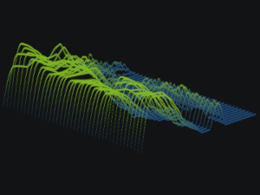
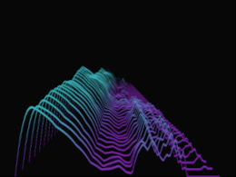
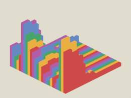
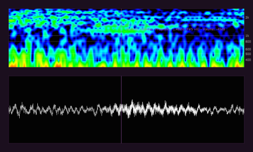

# 🐨 Spectrex

KoalaDSP's Spectrex is a Software Development Kit that lets you build GPU accelerated 2D and 3D spectrum visualizers.

  

Making visualization products with real-time spectrum analysis is not easy. We want to give audio developers a chance to create cool audio visualizations in their own apps and to be creative with audio signals and spectrums. This is why we've opened up a big part of our own library called **Spectrex**, free to use.

Spectrex supports OpenGL and JUCE, and has already shipped in various software products out there. The library is shipped precompiled, compatible with CMake, and its examples are fully open-source and built using JUCE. The library can be used with other frameworks as well.

🚀🚀🚀

#### Community Edition

This repository is the Community Edition, and is meant for fancy visualizations with aesthetic value.

The Community Edition is free to use in any application, and has the following features:

* 🐥 _High-level interface_: 2D real-time pan/zoom spectrogram + waveform that are fully synchronized.
* 🔮 _Low-level interface_: real-time processing that ties in with graphics APIs such as OpenGL.
* 📚 _JUCE examples_: 2D spectrogram + waveform, 3D spectrum visualizers using custom OpenGL shaders.
* 💻 _macOS and Windows_: Microsoft Visual Studio 2019, 2022 (Windows 7+) and latest Xcode (macOS 10.13+).

#### Enhanced Edition

If you're looking for more extensive applications involving accurate spectrum analysis, we also offer an Enhanced Edition.

The Enhanced Edition contains a few more exclusive features intended for more extensive applications, such as:

* 🌟 _FFT_: sizes up to 8192. (Community Edition: 256, 512)
* 🌟 _Waveform_: Stereo (2x), Left, Right, Mid, Side views. (Community Edition: 1x downmixed waveform)
* 🌟 _Override mode_: lets the Spectrogram and Waveform wrap from left to right.
* 🌟 _Playhead sync_: syncs the Spectrogram and Waveform position with the DAW playhead and in bars.
* 🌟 _Signal metering components_: CorrelationMeter, Goniometer and more visualization components.
* 🌟 _Customization_: More customization functions and properties for various classes.

Contact us to find out more.

### Documentation

For documentation, refer to the code (extensively documented), any included generated documentation, or the examples.

### Licensing

When including the precompiled libraries into your released products, please make sure to include the third-party attributions in `LICENSE.txt` somewhere in your software, installer or distribution.

The examples in `examples` are licensed using the open-source MIT license.

### Examples

The `examples` directory contains two examples built for JUCE: a real-time 2D spectrogram and waveform visualizer (`Viz2DApp`), and a real-time 3D spectrum visualizer using custom OpenGL shaders (`Viz3DApp`).

### Get in touch

Visit https://koaladsp.com or check out our [Discord](https://discord.gg/PFE5Byyr).
