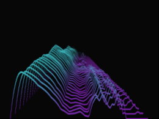

# Spectrex Examples for JUCE

This directory contains a few different examples that showcase how to use the Spectrex SDK in your own app, using the JUCE 7.x framework.

All of these examples can be built as standalone, VST3, VST2, AU, AAX or other formats using JUCE.

#### Viz2DApp

A real-time 2D spectrogram application with a spectrogram and waveform.

The app uses the high-level `KComponent` classes provided by the SDK, so you don't have to implement your own analyzers and meters.

* Fully synchronized spectrogram and waveform.
* Live parameter tweaking.
* Zooming and panning, lets you zoom into the data.
* Start and stop functionality.

#### Viz3DApp

A real-time 3D spectrum application that uses GL shaders to visualize the audio spectrum in different creative ways.

  

The app uses a lower level approach that lets you build your own shaders to visualize the synchronized spectrum data yourself. The examples includes vertex, geometry and fragment shaders to adjust. You can build any type of shader that leverages the real-time spectrum data, knock yourself out!

* A few colourful and retro 3D spectrum visualizers.
* Custom shaders to process incoming spectrogram data.
* Live parameter tweaking.
